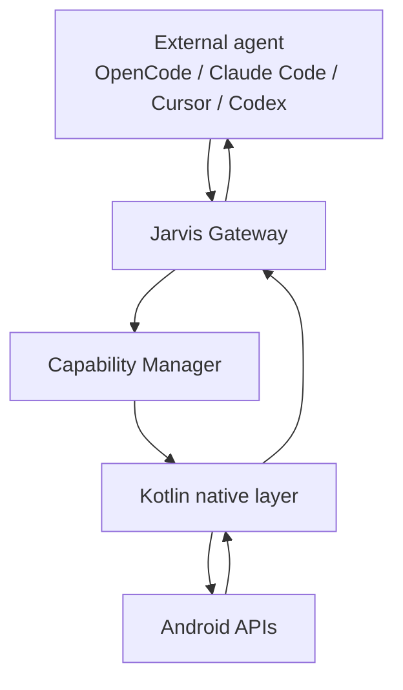

# Jarvis

Jarvis is a sideload-only Android personal AI agent for a phone you own. It observes the device through Android APIs, keeps a current world state, plans actions through a TypeScript Brain, and executes Android actions through a thin Kotlin capability layer.

## Vision

Jarvis is being built as a personal Android operating layer: an agent that can understand the current phone state, operate arbitrary apps through observation and interaction, and later use memory, voice, vision, plugins, and autonomous behaviors without turning the planner into a collection of app-specific automations.

## Architecture



Jarvis executes device capabilities and returns observations. The connected agent owns the loop.

See [Agent Gateway](docs/architecture/agent-gateway.md).

## Major capabilities

- Laptop-hosted TypeScript Brain for day-to-day development and cloud LLM testing.
- Android app connects to the Brain over a USB-reversed localhost port.
- Android Accessibility observation and action execution.
- Notification, SMS, call, battery, Bluetooth, WiFi, clipboard, package, foreground-app, lock, and charging event routing.
- World state, working memory, screen observer, context builder, and event history foundations.
- Floating Jarvis overlay with live task state.
- Local AI Runtime screen for MediaPipe/LiteRT model management and offline tests.

## Repository layout

```text
brain/       TypeScript Brain, planner, event bus, state, task runtime
mobile/      React Native UI plus Android Kotlin capability layer
docs/        Focused documentation for setup, architecture, development, release, and roadmap
```

## Quick start

The current development flow runs the Brain on the laptop and exposes it to the phone over ADB reverse. The phone connects through the reversed laptop port instead of reaching a local port directly on the device.

1. Install prerequisites and Java 17: [docs/getting-started/installation.md](docs/getting-started/installation.md)
2. Start the laptop Brain:

   ```bash
   cd ~/Downloads/Projects/Jarvis-Personal_Android_Agent/brain
   npm install
   npm run build
   npm start
   ```

   The Brain listens on `http://localhost:3000` and exposes the phone websocket at `ws://127.0.0.1:3000/phone`.

3. Share the ports to the phone:

   ```bash
   adb devices
   adb reverse tcp:3000 tcp:3000
   adb reverse tcp:8081 tcp:8081
   ```

   This is required so the Android app can reach the Brain while it is running on the laptop.

4. Start Metro from the mobile project:

   ```bash
   cd ~/Downloads/Projects/Jarvis-Personal_Android_Agent/mobile
   npm install
   npm start -- --reset-cache --port 8081
   ```

5. Launch the Android app in a second terminal:

   ```bash
   cd ~/Downloads/Projects/Jarvis-Personal_Android_Agent/mobile
   export JAVA_HOME=/usr/lib/jvm/java-17-openjdk-amd64
   export PATH=$JAVA_HOME/bin:$PATH
   npm run android -- --port 8081 --no-packager
   ```

6. [Run locally](docs/getting-started/running-locally.md)
7. [Review project structure](docs/getting-started/project-structure.md)
8. [Read the architecture overview](docs/architecture/overview.md)

> The app is configured for laptop Brain mode in `mobile/src/config.ts` with `brainWebSocketUrl: 'ws://127.0.0.1:3000/phone'` and `phoneAuthToken: 'jarvis-local-emulator-dev-token-2026'`.

## Documentation index

- [Getting started](docs/getting-started/README.md)
- [Architecture](docs/architecture/README.md)
- [Development](docs/development/debugging.md)
- [Testing](docs/development/testing.md)
- [Build](docs/deployment/build.md)
- [Release](docs/deployment/release.md)
- [Current status](docs/roadmap/current-status.md)
- [Roadmap](docs/roadmap/roadmap.md)
- [Future features](docs/roadmap/future-features.md)

## Current project status

Jarvis is a development prototype, not a production app. The event-driven foundation is implemented and validated on a connected Android device. Long-term memory, wake word, autonomous behaviors, plugin SDK, production release hardening, and a dedicated embedded JavaScript runtime are planned but not complete.

For the detailed status split between implemented, scaffolded, and planned work, see [docs/roadmap/current-status.md](docs/roadmap/current-status.md).
